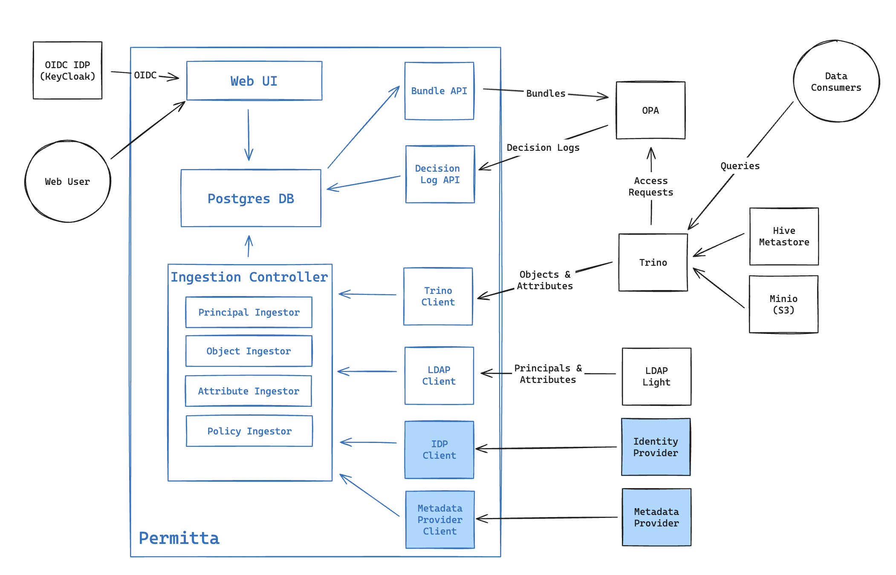

# Overview



## Motivation
In late 2023 [Open Policy Agent (OPA)](https://www.openpolicyagent.org/) was introduced into Trino as an [authentication method](https://trino.io/docs/current/security/opa-access-control.html).
OPA is a very powerful policy enforcement engine which helps to solve many authorisation issues with the previously available 
authorisation options in Trino. 

OPA provides the capability to implement very fine-grained R/ABAC policies to control access to data in Trino. OPA
policies can control access at the catalog, schema, table or column level and provide column masking. 

OPA policies are defined in a language called Rego. While it is an expressive and powerful language, it has a steep
learning curve and limits policy definition to users with software development skills. It is expected that users within 
many organisations who are tasked with data policy definition do not possess these types of skills.

OPA also requires context on the principals and objects, such as attributes or group mappings. This must be provided to OPA
as a (possibly) large JSON object, and updated whenever these values change.  

While extremely powerful, OPA is hard to use for non-developers, and has a significant integration cost. 

Permitta simplifies the use of OPA with Trino by:

* Providing a simple drag-and drop policy builder
* Aggregating metadata from sources such as `Active Directory`
* Delivering bundles of policy and context metadata to instances of OPA

## Trino / OPA Operation

When an SQL statement is supplied to Trino for execution, it executes a (potentially) large number of authorisation 
checks. Each of these authorisation checks includes an action, a subject and an object. The subject is the user executing
the query, and the object is the catalog, schema or table. 

Upon receiving an authorisation request OPA executes tests defined in the policy document using an input variable 
provided by Trino, against the data in the context data object.

For example, a user executes a simple query:

`SELECT a, b, c from datalake.hr.employees`
This results in many requests to OPA, one of which checks if this user (alice) 
is allowed to select these columns:
```json
{
  "context": {
    "identity": {
      "user": "alice"
    }
  },
  "action": {
    "operation": "SelectFromColumns",
    "resource": {
      "table": {
        "catalogName": "datalake",
        "schemaName": "hr",
        "tableName": "employees",
        "columns": ["a", "b", "c"]
      }
    }
  }
}
```

OPA will use this `input` object along with the policy document and `data` object 
supplied by Permitta to make a policy decision. An example below

```rego
package permitta.trino

# data object for reference
data := {
  "users": {
    "alice": {
      
    } 
  }
}

```