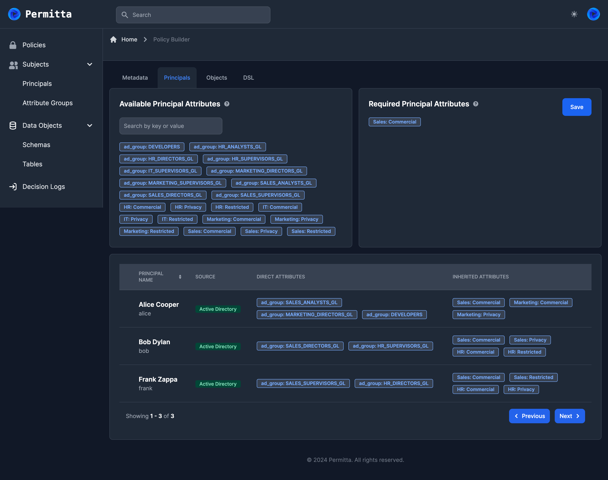
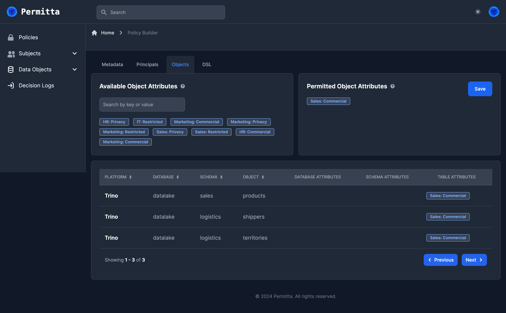

# Visual Policy Builder
One of the core features of Permitta is the policy builder. This provides
a visual drag-and-drop style interface for creating and maintaining
attribute-based policies.

Builder Policies in Permitta are best considered as an entity which selects a 
group of principals, and a group of objects. Think of a venn diagram with two
sets, one being principals and the other being objects. The intersection
(overlap) between these sets represents the access provided by the policy.

> It is important to understand that increasing the number of attributes
assigned to a policy serves to **reduce** its scope. This is because a builder
policy selects principals or objects which have **all** attributes. 

Policies are defined by the attributes assigned to them, rather than the objects
and principals which are selected by them. This means that policies are applied
dynamically, and any new users or objects introduced will be automatically included
in the policy if they are assigned the requisite attributes.

## Principal Selection

### Available Principal Attributes Pane
The upper-left pane includes all principal attributes that Permitta is aware of. 
This is an exhaustive list of attributes currently assigned to principals which permitta has ingested.

### Required Principal Attributes Pane
Attributes can be dragged-and-dropped into this pane to form the policy.
The policy will select all principals who possess **all** of the  

### Principals List Pane
The lower pane shows the list of principals who are included in this policy
along with their attributes.

## Data Object Selection
Data object selection operates in a similar manner to the principal selection view.
Attributes can be dragged from the left-hand pane to the right, and in doing so,
the list of applicable objects is extended or reduced dynamically.

