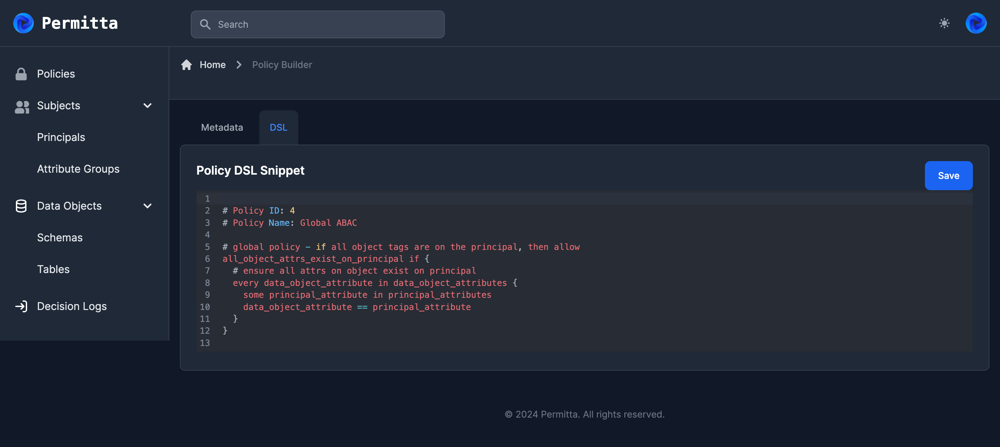

# DSL Editor

The DSL editor provides an IDE where `rego` code can be written and modified 
within Permitta. Each DSL policy consists of a `rego` snippet, which is compiled
into a complete policy document along with the content of the builder policies.

The IDE is based on `codemirror` and includes formatting and syntax highlighting.

Policy workflows apply to policies defined using the DSL editor, in
the same way as builder policies.

> Future feature: Rego evaluation and linting via OPA APIs

