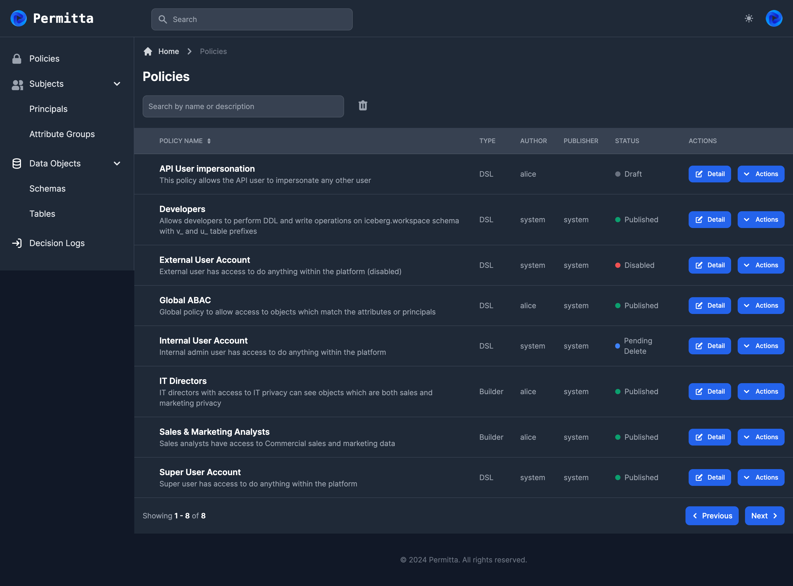

# Policy Management
The main interactive feature in the Permitta UI is the policy editor.
In this interface, a user can create, modify, or request publish or deletion of a policy.

Policies in Permitta take two main forms, `Builder` and `DSL`.

## Builder Policies
Builder policies are created using a drag-and-drop interface. Simple `AND` logic
is implemented within builder policies and policies are OR'ed together. This method
creates a safe means of policy modification, as highly specific  policies can be 
added without risk of impacting existing consumers. This makes Permitta's builder
policies very easy to understand and build.

## DSL Policies
DSL policies provide an interface to write and edit `Rego` code directly. This 
allows for highly nuanced policies to be created by power users. This way, Permitta
does not restrict users from enabling the full functionality of OPA, but retains 
the UI and approval workflow.

> See [Policies](workflow.md) for more information on policy workflows

## Policy Listing
The policy listing presents all policies created in Permitta,
along with their policy type (DSL or Builder) and state.

From this view, users can view or modify content and state of the policies.

## Policy Workflow

A policy in Permitta has an associated state. 
The policy workflow defines which states a policy can move to, depending on its current state.

Only policies which are in `Published` or `Pending Disable` are included in the bundle provided to OPA/Trino.

### Possible Next States
| State           | Description                                              | Possible next states     |
|-----------------|----------------------------------------------------------|--------------------------|
| Draft           | A new policy which currently has no effect               | Pending Publish, Deleted |
| Pending Publish | A policy which is waiting on approval of an owner        | Published, Draft         |
| Published       | A live policy which affects users                        | Pending Disable          |
| Pending Disable | A live policy which is waiting on approval to deactivate | Published, Disables      |
| Disabled        | A policy which was published, but now has no effect      | Deleted, Pending Publish |
| Deleted         | A policy which has been marked deleted                   | <N/A>                    |

User permissions for state transitions are defined in a `rego` document. This provides a high degree of flexibility
when assigning which users can make which changes. See [Auth](../security/auth.md) for more information.